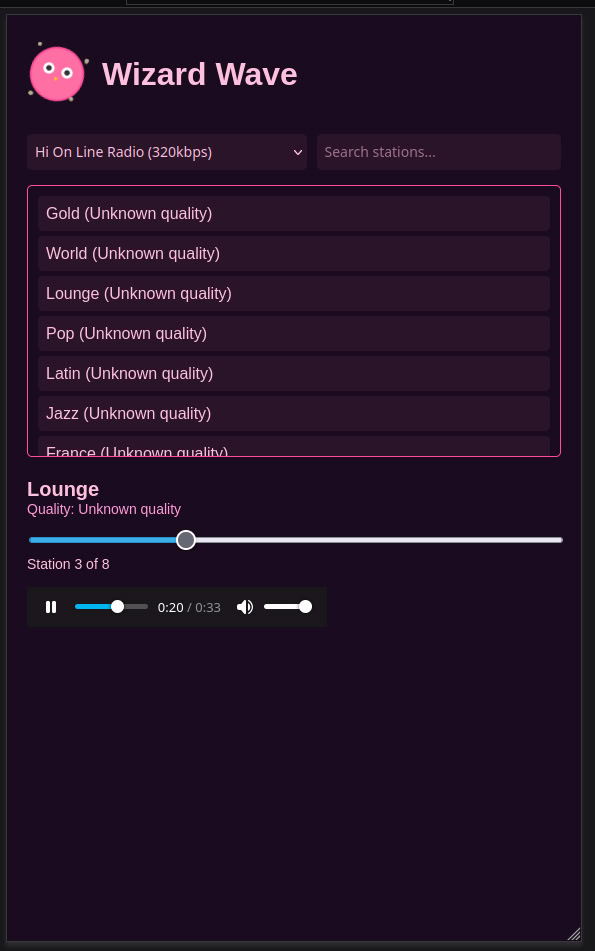

# WizardWave

**WizardWave** – a magical dark-pink radio player for wizards and dreamers. WizardWave streams your favorite radio stations with style, making your daily tasks feel spellbinding.  

---

## Features

- Dark-pink wizard-themed interface
- Rotating owl SVG logo with sparkling shine effects
- Searchable and filterable station list
- Category dropdown for easy navigation
- Slider for quick station selection
- Autoplay and audio controls
- Responsive and mobile-friendly design

---

## How it Works

WizardWave parses an **OPML playlist** of radio stations and dynamically loads them into the player. The player shows station name, quality, and lets you browse stations via the slider or station list.

---

## Credits

This project uses the **[playlist-radio OPML repository](https://github.com/lovehifi/playlist-radio)** as a source for creating the OPML file, which is then parsed to populate and play stations in WizardWave.

---

